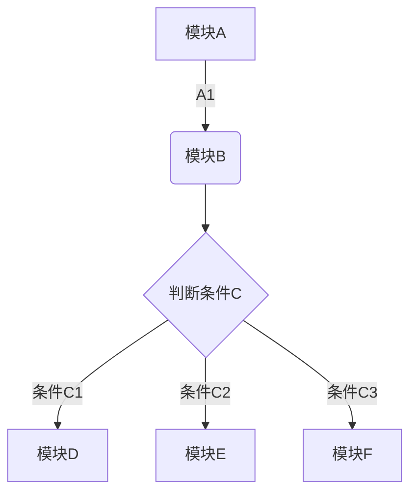
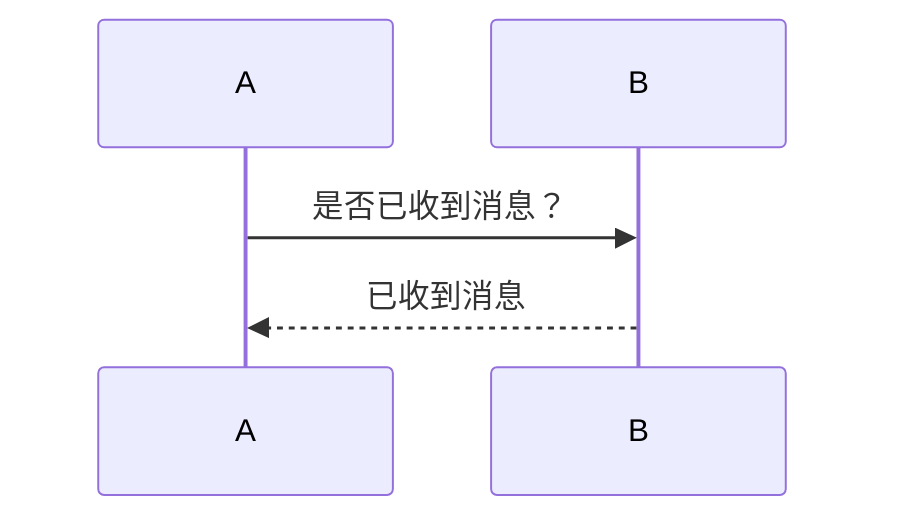
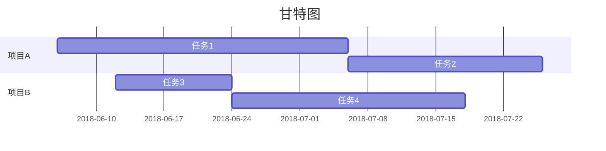

**印象笔记**

*印象笔记*

<u>印象笔记</u>
~~印象笔记不支持Markdown~~

* * *
>近日，印象笔记宣布完成重组。作为Evernote已在中国独立运营近6年的品牌，印象笔记将成为由中方控股的中美合资独立运营实体，并获得红杉宽带跨境数字产业基金首轮数亿元人民币投资。
>fd

使用 iOS 版本印象笔记如何快速保存内容？

1. 启用印象笔记 Widget ——印象笔记·剪贴板
2. 复制粘贴任意内容
     * 微信
3. 滑动到 Widget 插件区域即可完成保存

印象笔记·剪贴板有什么特点？

* 快：开启自动模式，可以自动保存剪贴板的任意内容
* 一切：只要可以复制粘贴就可以保存
* 有序：全部保存在「我的剪贴板」笔记本并以时间来命名

三只青蛙

* [x] 第一只青蛙
* [ ] 第二只青蛙
* [ ] 第三只青蛙

[印象笔记官网](https://www.yinxiang.com/)


| 帐户类型 | 免费帐户 | 标准帐户 | 高级帐户 |
| --- | --- | --- | --- |
| 帐户流量 | 60M | 1GB | 10GB |
| 设备数目 | 2台 | 无限制 | 无限制 |
| 当前价格 | 免费 | ￥8.17/月 | ￥12.33/月|

```chart
,预算,收入,花费,债务
June,5000,8000,4000,6000
July,3000,1000,4000,3000
Aug,5000,7000,6000,3000
Sep,7000,2000,3000,1000
Oct,6000,5000,4000,2000
Nov,4000,3000,5000,

type: pie
title: 每月收益
x.title: Amount
y.title: Month
y.suffix: $
```

```python
#!/usr/bin/python
import re

line = "Cats are smarter than dogs"

matchObj = re.match( r'(.*) are (.*?) .*', line, re.M|re.I)

if matchObj:
    print "matchObj.group() : ", matchObj.group()
    print "matchObj.group(1) : ", matchObj.group(1)
    print "matchObj.group(2) : ", matchObj.group(2)
else:
    print "No match!!"
```

```math
e^{i\pi} + 1 = 0
```







[TOC]


